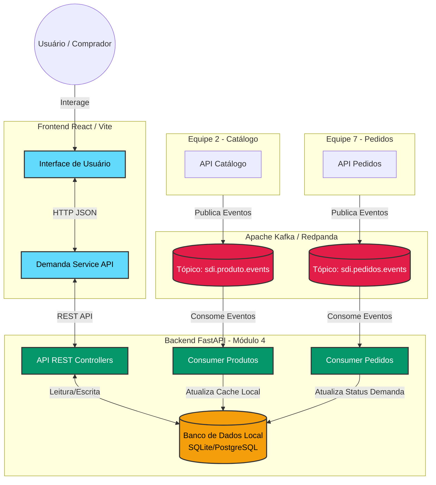

# Documentação Oficial da API - Módulo de Compradores (Equipe 4)

Este documento detalha a arquitetura, endpoints, contratos de dados e integrações (Kafka) do Módulo de Compradores (Demandas e Intenções de Compra) do Portal B2B.

---

## 🏗️ Arquitetura e Fluxo de Dados

O módulo foi desenhado com arquitetura de microsserviços. Ele expõe uma API REST para o Frontend (React) e consome eventos assíncronos via Apache Kafka para manter uma base de dados local atualizada com as informações de outros domínios (como o Catálogo de Produtos).

### Fluxograma do Sistema



## 🛠️ Stack Tecnológica

- **Backend:** Python 3.10+, FastAPI, SQLAlchemy, Pydantic v2
- **Frontend:** React, Vite, TypeScript, TailwindCSS, TanStack Query
- **Banco de Dados:** SQLite (Desenvolvimento) / PostgreSQL (Produção - Previsto)
- **Mensageria:** Apache Kafka (via `confluent-kafka` e Redpanda)
- **Agendamento (Jobs):** APScheduler (para demandas recorrentes)

---

## 🔗 Integração Kafka (Mensageria)

O módulo atua tanto como **Consumidor** (para espelhar dados externos) quanto como **Produtor** (para notificar outras equipes sobre intenções de compra).

### 📥 Consumidor (Eventos Recebidos)

O módulo escuta eventos para manter cache local e sincronizar o status das demandas.

#### 1. Eventos de Produtos (Equipe 2 - Catálogo)
Garante resiliência tendo um espelho dos produtos localmente.
- **Tópico:** `sdi.produto.events`

> ⚠️ **Divergência atual de implementação:** o `produto_consumer.py` está inscrito no tópico `produto_cadastrado`, não em `sdi.produto.events`. Combinar com a Equipe 2 e padronizar.

- **Ação:** Cria/atualiza registros na tabela `produto_cache`.
- **Payload Esperado:**
```json
{
  "eventId": "uuid-do-evento",
  "eventType": "ProdutoCriado", // ou ProdutoAtualizado
  "timestamp": "2023-10-27T10:00:00Z",
  "data": {
    "id": "uuid-do-produto",
    "codigo": "NOTE-001",
    "nome": "Notebook XYZ",
    "ativo": true
  }
}
```

#### 2. Eventos de Pedidos (Equipe 7 - Pedidos)
**Atenção Equipe 7:** Adotamos a abordagem de *Consumer-Driven Contracts*. O módulo de compradores **exige** que os eventos de criação de pedido trafeguem a informação `id_demanda` correspondente na raiz do payload.
- **Tópico:** `sdi.pedidos.events`
- **Ação:** Busca a Demanda pelo ID fornecido e atualiza o seu `status` para `atendida`.
- **Payload Esperado (Obrigatório):**
```json
{
  "eventId": "uuid-do-evento",
  "eventType": "pedido_criado",
  "correlationId": "uuid-correlacao",
  "payload": {
    "id_demanda": "uuid-da-demanda",
    "id_pedido": "uuid-do-pedido",
    "status": "processando"
  }
}
```

### 📤 Produtor (Eventos Publicados)

O módulo notifica o ecossistema sempre que uma nova demanda de compra surge (seja manualmente ou via agendamento). A chave (Key) da mensagem no Kafka é sempre o `id_demanda`.

#### Evento: Demanda Criada Manualmente
- **Tópico:** `demanda_criada`
- **Gatilho:** Quando o comprador cria uma demanda pelo Frontend ou converte um item da Wishlist.
- **Envelope do Evento:**
```json
{
  "eventId": "uuid-do-evento",
  "eventType": "demanda_criada",
  "eventVersion": "1.0",
  "timestamp": "2023-10-27T10:00:00Z",
  "source": "modulo-compradores",
  "correlationId": "uuid-da-demanda",
  "payload": {
    "id_demanda": "uuid-da-demanda",
    "id_produto": "uuid-do-produto",
    "quantidade_desejada": 10
  }
}
```

#### Evento: Demanda Recorrente Gerada (Job)
- **Tópico:** `demanda_recorrente_gerada`
- **Gatilho:** Quando o *APScheduler* roda em background e cria automaticamente uma demanda baseada em uma assinatura/recorrência.
- **Envelope do Evento:** Formato idêntico ao `demanda_criada`, mudando apenas o `eventType` para `demanda_recorrente_gerada`.

---

## 🌐 Referência da API REST

URL Base: `http://localhost:5004` (ou roteado via API Gateway em `/api/`)

### 🔐 Autenticação

Todos os endpoints (exceto `/ping`) exigem o header `Authorization: Bearer <jwt>`. O JWT deve conter as claims:

- `sub`: id do usuário
- `empresa_id`: id da empresa do comprador
- `aud`: `portal-b2b`
- `iss`: `portal-autenticacao`

O `id_empresa` e `id_usuario` são extraídos do token — **não devem mais ser enviados em body, query ou path**.

### 1. Demandas

Gerencia o ciclo de vida das intenções de compra.

#### `GET /demandas`
Lista as demandas da empresa autenticada.
- **Query Params:** `is_pedido` (Opcional, bool) — filtra entre demandas e pedidos.
- **Exemplos:**
  - `GET /demandas` → todas as demandas da empresa
  - `GET /demandas?is_pedido=true` → só os pedidos
  - `GET /demandas?is_pedido=false` → só as demandas que ainda não viraram pedido
- **Response (200 OK):** Array de objetos Demanda.

#### `POST /demandas`
Cria uma nova demanda.
- **Body:**
  ```json
  {
    "id_produto": "uuid-produto",
    "id_endereco_destino": "uuid-endereco",
    "quantidade_desejada": 10,
    "preco_maximo": 1500.00, // Opcional
    "prioridade": "media",   // alta, media, baixa
    "is_recorrente": false
  }
  ```
- **Response (201 Created):** Objeto Demanda criado.

#### `PATCH /demandas/{id_demanda}/status`
Atualiza o status de uma demanda.
- **Body:** `{ "status": "em_negociacao" }`
- **Response (200 OK):** Objeto Demanda atualizado.
- **Efeitos colaterais Kafka:** se a demanda for um pedido (`is_pedido=true`), publica `pedido_atualizado` no tópico `pedido_atualizado` com o novo status no payload. Se ainda for demanda comum (`is_pedido=false`), não publica nada (a doc oficial do professor não tem evento `demanda_atualizada`).

#### `PATCH /demandas/{id_demanda}/cancelar`
Cancela uma demanda (Soft Delete / Mudança de Status).
- **Response (200 OK):** Objeto Demanda cancelado.

#### `PATCH /demandas/{id_demanda}/promover`
Promove uma demanda para pedido (marca `is_pedido=true`). **Idempotente:** se a demanda já for pedido, retorna o estado atual sem alteração.
- **Erros:**
  - `400 Bad Request` — `"Demanda não encontrada"` (id não existe na empresa do token).
  - `400 Bad Request` — `"Não é possível promover demanda cancelada para pedido"`.
- **Response (200 OK):** Objeto Demanda atualizado com `is_pedido: true`.
- **Efeitos colaterais Kafka:** publica `pedido_criado` no tópico `pedido_criado` com envelope padrão do professor e `source=modulo-compradores`. A 2ª chamada não dispara evento (idempotência cai antes do producer). Nosso próprio `pedido_consumer` ignora eventos com `source=modulo-compradores` (anti-loop).

---

### 2. Endereços de Entrega

Cadastro de endereços locais do comprador para entregas das demandas.

#### `GET /demandas/enderecos`
Lista os endereços ativos da empresa.
- **Query Params:** `id_empresa` (Opcional)
- **Response (200 OK):** Array de Endereços.

#### `POST /demandas/enderecos` (Alias: `POST /enderecos`)
Cadastra um novo endereço de entrega.
- **Body:**
  ```json
  {
    "apelido": "Sede Principal", // Opcional
    "logradouro": "Avenida Paulista",
    "numero": "1000",
    "complemento": "Andar 5",
    "bairro": "Bela Vista",
    "cidade": "São Paulo",
    "uf": "SP", // Aceita 'uf' ou 'estado'
    "cep": "01310-100"
  }
  ```
- **Response (201 Created):** Objeto Endereço criado.

#### `PUT /enderecos/{id_endereco}`
Atualiza um endereço de entrega existente. Mesmo schema do `POST /enderecos`.
- **Body:** Igual ao body do `POST /enderecos`.
- **Response (200 OK):** Objeto Endereço atualizado.
- **Response (404 Not Found):** Endereço não encontrado ou não pertence à empresa do token.

#### `DELETE /enderecos/{id_endereco}`
Desativa um endereço (Soft Delete).
- **Response (204 No Content)**

---

### 3. Wishlist (Lista de Desejos)

Itens que o comprador deseja, mas ainda não formalizou como demanda.

#### `GET /demandas/wishlist`
Lista itens na wishlist.
- **Response (200 OK):** Array de Itens da Wishlist.

#### `POST /demandas/wishlist`
Adiciona um item à wishlist.
- **Body:** Payload similar à criação de demanda, sem endereço.

#### `POST /demandas/wishlist/{id_item}/converter`
Converte um item da wishlist em uma demanda real.
- **Body:**
  ```json
  {
    "id_endereco_entrega": "uuid-endereco"
  }
  ```
- **Response (201 Created):** Objeto Demanda recém-criado.

---

### 4. Cache de Produtos (Projeção)

Endpoints de consulta de leitura (Read-Model) dos dados cacheados via Kafka.

#### `GET /demandas/produtos/projecao/{id_produto}`
Busca os detalhes básicos de um produto pelo ID. Usado pelo Frontend para exibir o nome do produto nas listagens de demandas sem precisar chamar a API do Catálogo (Equipe 2).
- **Response (200 OK):**
  ```json
  {
    "id": "uuid-produto",
    "codigo": "NOTE-001",
    "nome": "Notebook XYZ",
    "categoria": "N/D",
    "unidade": "UN",
    "sincronizado_em": "2023-10-27T10:05:00Z"
  }
  ```
- **Response (404 Not Found):** Se o Kafka ainda não tiver consumido o evento deste produto.

---

## 🛠️ Como Integrar (Frontend)

O Frontend (React/Vite) já possui o proxy configurado em `vite.config.ts`:

```typescript
// vite.config.ts
proxy: {
  "/api": {
    target: "http://127.0.0.1:5004", // Porta do Backend FastAPI
    rewrite: (path) => path.replace(/^\/api/, ""),
  },
}
```

O Frontend chama a API utilizando a instância configurada do Axios ou Fetch nativo, lidando com os DTOs diretamente.

Exemplo de chamada com TanStack Query:
```typescript
import { api } from "./api";

export async function listarDemandas(): Promise<Demanda[]> {
  return await api.get<Demanda[]>("/api/demandas");
}
```

## 🧪 Dados de Teste (Seed)
Para popular o banco local com dados de teste para visualização no frontend, utilize o script de seed:

1. Pare a execução do servidor Uvicorn/FastAPI.
2. Execute o script ativando o ambiente virtual:
   ```bash
   .\venv\Scripts\python.exe seed.py
   ```
3. Reinicie o servidor:
   ```bash
   python main.py
   ```
