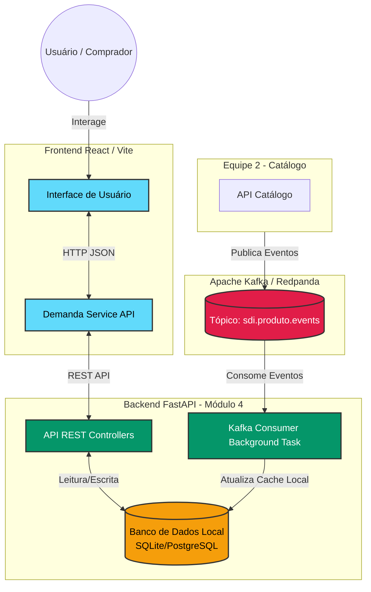

# Documentação Oficial da API - Módulo de Compradores (Equipe 4)

Este documento detalha a arquitetura, endpoints, contratos de dados e integrações (Kafka) do Módulo de Compradores (Demandas e Intenções de Compra) do Portal B2B.

---

## 🏗️ Arquitetura e Fluxo de Dados

O módulo foi desenhado com arquitetura de microsserviços. Ele expõe uma API REST para o Frontend (React) e consome eventos assíncronos via Apache Kafka para manter uma base de dados local atualizada com as informações de outros domínios (como o Catálogo de Produtos).

### Fluxograma do Sistema



---

## 🔗 Integração Kafka (Mensageria)

O módulo atua como **Consumidor** para manter uma projeção local (cache) dos produtos. Isso garante que a API de demandas continue funcionando mesmo se o microsserviço de Catálogo estiver fora do ar.

### Tópico Consumido
- **Nome:** `sdi.produto.events`
- **Broker:** `localhost:9092` (Configurável via `KAFKA_BOOTSTRAP_SERVERS`)
- **Ação:** Criação ou atualização na tabela `produto_cache`.

### Payload Esperado (Envelope Padrão)
```json
{
  "eventId": "uuid-do-evento",
  "eventType": "ProdutoCriado", // ou ProdutoAtualizado
  "timestamp": "2023-10-27T10:00:00Z",
  "data": {
    "id": "uuid-do-produto",
    "codigo": "NOTE-001",
    "nome": "Notebook XYZ",
    "ativo": true
  }
}
```

---

## 🌐 Referência da API REST

URL Base: `http://localhost:5004` (ou roteado via API Gateway em `/api/`)

> **Nota sobre Autenticação:** Atualmente, a API aceita `id_empresa` e `id_usuario` diretamente nos payloads ou parâmetros de desenvolvimento. Quando o módulo de IAM (JWT) for integrado, esses dados serão extraídos do Token no Header `Authorization`.

### 1. Demandas

Gerencia o ciclo de vida das intenções de compra.

#### `GET /demandas`
Lista todas as demandas da empresa.
- **Query Params:** `id_empresa` (Opcional, para testes)
- **Response (200 OK):** Array de objetos Demanda.

#### `POST /demandas`
Cria uma nova demanda.
- **Body:**
  ```json
  {
    "id_empresa_comprador": "uuid-empresa",
    "id_usuario_criador": "uuid-usuario",
    "id_produto": "uuid-produto",
    "id_endereco_destino": "uuid-endereco",
    "quantidade_desejada": 10,
    "preco_maximo": 1500.00, // Opcional
    "prioridade": "media",   // alta, media, baixa
    "is_recorrente": false
  }
  ```
- **Response (201 Created):** Objeto Demanda criado.

#### `PATCH /demandas/{id_demanda}/status`
Atualiza o status de uma demanda.
- **Body:** `{ "status": "em_negociacao" }`
- **Response (200 OK):** Objeto Demanda atualizado.

#### `PATCH /demandas/{id_demanda}/cancelar`
Cancela uma demanda (Soft Delete / Mudança de Status).
- **Response (200 OK):** Objeto Demanda cancelado.

---

### 2. Endereços de Entrega

Cadastro de endereços locais do comprador para entregas das demandas.

#### `GET /demandas/enderecos`
Lista os endereços ativos da empresa.
- **Query Params:** `id_empresa` (Opcional)
- **Response (200 OK):** Array de Endereços.

#### `POST /demandas/enderecos` (Alias: `POST /enderecos`)
Cadastra um novo endereço de entrega.
- **Body:**
  ```json
  {
    "id_empresa": "uuid-empresa",
    "apelido": "Sede Principal", // Opcional
    "logradouro": "Avenida Paulista",
    "numero": "1000",
    "complemento": "Andar 5",
    "bairro": "Bela Vista",
    "cidade": "São Paulo",
    "uf": "SP", // Aceita 'uf' ou 'estado'
    "cep": "01310-100"
  }
  ```
- **Response (201 Created):** Objeto Endereço criado.

#### `DELETE /enderecos/{id_endereco}`
Desativa um endereço (Soft Delete).
- **Query Params:** `id_empresa` (Obrigatório para segurança)
- **Response (204 No Content)**

---

### 3. Wishlist (Lista de Desejos)

Itens que o comprador deseja, mas ainda não formalizou como demanda.

#### `GET /demandas/wishlist`
Lista itens na wishlist.
- **Query Params:** `id_empresa`, `id_usuario`
- **Response (200 OK):** Array de Itens da Wishlist.

#### `POST /demandas/wishlist`
Adiciona um item à wishlist.
- **Body:** Payload similar à criação de demanda, sem endereço.

#### `POST /demandas/wishlist/{id_item}/converter`
Converte um item da wishlist em uma demanda real.
- **Body:**
  ```json
  {
    "id_endereco_entrega": "uuid-endereco"
  }
  ```
- **Response (201 Created):** Objeto Demanda recém-criado.

---

### 4. Cache de Produtos (Projeção)

Endpoints de consulta de leitura (Read-Model) dos dados cacheados via Kafka.

#### `GET /demandas/produtos/projecao/{id_produto}`
Busca os detalhes básicos de um produto pelo ID. Usado pelo Frontend para exibir o nome do produto nas listagens de demandas sem precisar chamar a API do Catálogo (Equipe 2).
- **Response (200 OK):**
  ```json
  {
    "id": "uuid-produto",
    "codigo": "NOTE-001",
    "nome": "Notebook XYZ",
    "categoria": "N/D",
    "unidade": "UN",
    "sincronizado_em": "2023-10-27T10:05:00Z"
  }
  ```
- **Response (404 Not Found):** Se o Kafka ainda não tiver consumido o evento deste produto.

---

## 🛠️ Como Integrar (Frontend)

O Frontend (React/Vite) já possui o proxy configurado em `vite.config.ts`:

```typescript
// vite.config.ts
proxy: {
  "/api": {
    target: "http://127.0.0.1:5004", // Porta do Backend FastAPI
    rewrite: (path) => path.replace(/^\/api/, ""),
  },
}
```

O Frontend chama a API utilizando a instância configurada do Axios ou Fetch nativo, lidando com os DTOs diretamente.

Exemplo de chamada com TanStack Query:
```typescript
import { api } from "./api";

export async function listarDemandas(): Promise<Demanda[]> {
  return await api.get<Demanda[]>("/api/demandas");
}
```

## 🧪 Dados de Teste (Seed)
Para popular o banco local com dados de teste para visualização no frontend, utilize o script de seed:

1. Pare a execução do servidor Uvicorn/FastAPI.
2. Execute o script ativando o ambiente virtual:
   ```bash
   .\venv\Scripts\python.exe seed.py
   ```
3. Reinicie o servidor:
   ```bash
   python main.py
   ```
