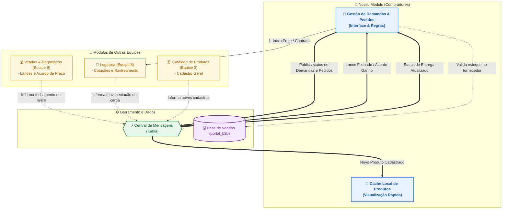
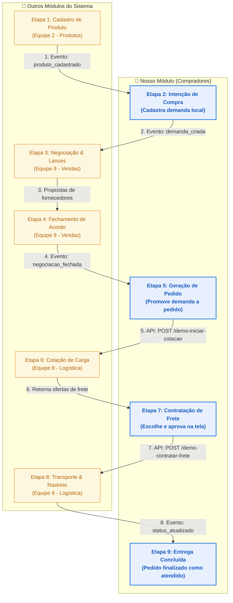

# Fluxo de Integrações — Módulo de Demandas

Este documento apresenta o fluxo de comunicação do microsserviço **Demandas** (Módulo de Compradores / Nosso Módulo) com os outros módulos do portal B2B, focado no fluxo operacional e de negócios do sistema.

---

## 🗺️ Mapa de Fluxo do Sistema

O fluxograma abaixo mostra como as informações trafegam entre as equipes via API, Banco Compartilhado e Eventos no Barramento (Kafka):

---

## ⏳ Linha do Tempo: Do Cadastro à Entrega

Este fluxograma sequencial ilustra a jornada completa de uma compra — desde o cadastro inicial do produto até a entrega final ao comprador — destacando as interações entre as diferentes equipes do sistema:

---

## 🔄 Fluxo de Negócio das Integrações

O ciclo de vida de uma compra passa pelas seguintes interações com módulos externos:

### 1. Criação e Catalogação
* **Com o módulo de Produtos (Equipe 2):** 
  * Sempre que um produto é cadastrado ou atualizado no sistema, nosso módulo consome esse aviso e atualiza um cache de produtos local. Isso garante que a nossa tela sempre mostre os nomes corretos dos produtos sem lentidão.
  * Publicamos um evento no barramento toda vez que uma demanda de compra é criada ou cancelada para que os fornecedores possam ver o interesse do mercado.

### 2. Negociação de Preços
* **Com o módulo de Vendas & Negociação (Equipe 9):**
  * Quando um comprador aceita lances ou a negociação é fechada, o módulo de Vendas envia uma mensagem para o barramento.
  * Ao receber o aviso de negociação ganha, nosso módulo automaticamente promove a intenção de compra a um **Pedido** formalizado.

### 3. Validação e Cotação de Transporte
* **Com a Logística (Equipe 8) e Banco de Vendas:**
  * Para promoções manuais de pedidos, validamos diretamente no banco de dados de Vendas se o fornecedor parceiro ainda possui estoque físico disponível.
  * Assim que o pedido é gerado, nosso sistema faz uma chamada à API de Logística para disparar o processo de cotação de frete.
  * A Logística busca ofertas de transporte e devolve para a nossa tela uma lista com prazos e valores de transportadoras. O comprador escolhe a melhor opção e clica para contratar, notificando a Logística via API.

### 4. Rastreio e Finalização
* **Com a Logística (Equipe 8):**
  * À medida que a transportadora movimenta a mercadoria, a Logística publica atualizações de rastreamento no barramento.
  * Nosso módulo escuta e atualiza a tela do comprador em tempo real (ex.: mostrando status como "Em Trânsito"). Quando a carga é marcada como "Entregue", finalizamos o status do pedido local.
